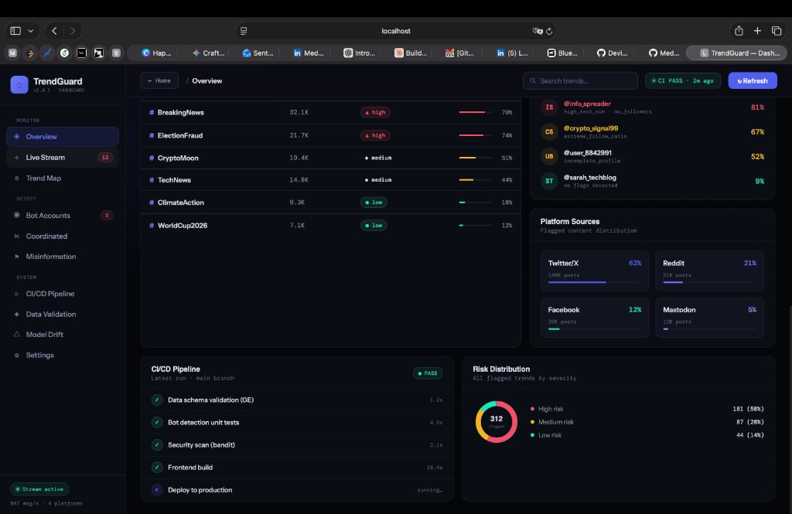
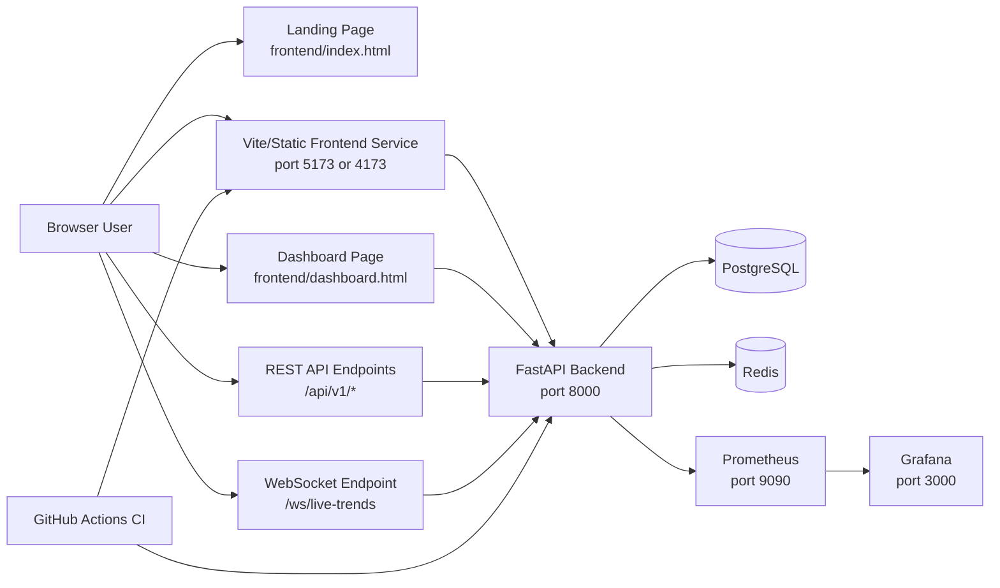

# TrendGuard

TrendGuard is a social media data integrity project that includes:

- A **marketing/landing page** (`frontend/index.html`)
- A **dashboard page** (`frontend/dashboard.html`)
- A **FastAPI backend** with REST + WebSocket endpoints (`backend/app/main.py`)
- Optional full-stack infrastructure via **Docker Compose** (`docker-compose.yml`)

This README explains exactly what is in this repository and how to run it step by step.

---

## 1) What Is In This Repository

Project structure (important paths):

- `frontend/index.html`  
  Main landing page (static HTML/CSS/JS).
- `frontend/dashboard.html`  
  Main dashboard UI page (static HTML/CSS/JS with Chart.js CDN).
- `backend/`  
  FastAPI application + tests.
- `monitoring/`  
  Prometheus config and Grafana dashboard JSON.
- `.github/workflows/ci-cd.yml`  
  CI pipeline for backend/frontend checks.
- `docker-compose.yml`  
  Local multi-service stack (backend, frontend, postgres, redis, prometheus, grafana).
- `.env.example`  
  Environment variable template.
- `TRENDGUARD_SETUP_GUIDE.md`  
  Full reference setup guide used to build this project.

---

## 2) Prerequisites

Install these first:

- **Node.js** >= 18
- **Python** >= 3.11
- **Git**
- **Docker Desktop** (optional, only if running via Docker)

Check versions:

```bash
node --version
python3 --version
git --version
docker --version
docker compose version
```

If Docker commands fail, install Docker Desktop and make sure it is running.

---

## 3) Clone and Enter Project

```bash
git clone https://github.com/MedhaUdupa/trend-guard.git
cd trend-guard
```

---

## 4) Environment Setup

Copy environment template:

```bash
cp .env.example .env
```

What to edit in `.env`:

- `DB_PASSWORD` -> password for postgres
- `REDIS_PASSWORD` -> password for redis
- `JWT_SECRET` -> long random secret
- `GRAFANA_PASSWORD` -> grafana admin password
- `TWITTER_BEARER_TOKEN` -> optional for live social ingestion

Note: `.env` is ignored by git; only `.env.example` is committed.

---

## 5) Run The Website Fastest (Static HTML Mode)

This mode serves the exact delivered `index.html` and `dashboard.html` files.

From project root:

```bash
cd frontend
python3 -m http.server 4173
```

Open:

- `http://localhost:4173/index.html`
- `http://localhost:4173/dashboard.html`

Use this mode when you want the exact static design/pages immediately.

---

## 6) Run Frontend With Vite (Dev Mode)

From project root:

```bash
cd frontend
npm install
npm run dev
```

Default Vite URL:

- `http://localhost:5173`

Useful frontend commands:

```bash
npm run test
npm run build
npm run lint
```

---

## 7) Run Backend Locally (Without Docker)

From project root:

```bash
cd backend
python3 -m venv venv
source venv/bin/activate
pip install -r requirements.txt
uvicorn app.main:app --host 0.0.0.0 --port 8000
```

Backend URLs:

- API root endpoints under:
  - `http://localhost:8000/api/v1/trends`
  - `http://localhost:8000/api/v1/analytics`
  - `http://localhost:8000/api/v1/health`
- Docs (in non-production mode):  
  `http://localhost:8000/docs`
- Metrics:  
  `http://localhost:8000/metrics`
- WebSocket:  
  `ws://localhost:8000/ws/live-trends`

Run backend tests:

```bash
cd backend
source venv/bin/activate
pytest tests -q
```

---

## 8) Run Full Stack With Docker Compose

From project root:

```bash
cp .env.example .env
docker compose up -d --build
```

Services exposed:

- Frontend: `http://localhost:5173`
- Backend: `http://localhost:8000`
- Backend docs: `http://localhost:8000/docs`
- Prometheus: `http://localhost:9090`
- Grafana: `http://localhost:3000`

Check service status:

```bash
docker compose ps
docker compose logs -f backend
```

Stop stack:

```bash
docker compose down
```

---

## 9) Git Workflow Used For This Project

Current remote repository:

- `https://github.com/MedhaUdupa/trend-guard`

Typical update flow:

```bash
git checkout main
git pull
# make changes
git add .
git commit -m "Your message"
git push origin main
```

---

## 10) CI/CD Overview

GitHub Actions workflow (`.github/workflows/ci-cd.yml`) runs:

1. Data validation test
2. Backend tests
3. Frontend test + build
4. Deploy job gate after all tests pass

This keeps changes from being merged/deployed with obvious errors.

---

## 11) Troubleshooting

### Docker command not found

- Install Docker Desktop.
- Start Docker Desktop app.
- Re-open terminal.
- Verify with:

```bash
docker --version
docker compose version
```

### Port already in use

If `4173`, `5173`, or `8000` is busy, stop old process or run on a different port.

### Backend import errors in tests

Run tests from `backend/` and ensure venv is active:

```bash
cd backend
source venv/bin/activate
pytest tests -q
```

---

## 12) What To Open First

If you want to see exactly what was delivered visually:

1. Start static server in `frontend/`
2. Open `http://localhost:4173/index.html`
3. Open `http://localhost:4173/dashboard.html`

If you want full application stack:

1. Configure `.env`
2. Run `docker compose up -d --build`
3. Open frontend/backend/monitoring URLs listed above.

---

## 13) Screenshots

### Dashboard Overview

This is the current dashboard UI in this repository:



---

## 14) Architecture

The diagram below shows how the current project components connect in development.



---

## 15) Dashboard Purpose (What We Track)

This dashboard is designed to track **social signal integrity**: whether online trends are organic or manipulated.

The main tracking goals are:

1. **Trend volume health**  
   Which hashtags/topics are growing and how fast.
2. **Inorganic behavior risk**  
   Whether growth is likely coordinated, bot-driven, or suspicious.
3. **Bot account indicators**  
   Accounts with suspicious patterns (new account, extreme posting rate, follower anomalies, repeated text patterns).
4. **Alert stream**  
   Real-time events that need attention (spikes, bot clusters, schema drift warnings).
5. **Data reliability checks**  
   Whether incoming API data still matches expected schema and quality rules.
6. **Pipeline confidence**  
   Whether CI/CD checks (validation/tests/scans/build) are currently passing.

In short: this is not only a chart dashboard; it is an **integrity monitoring surface** for social data operations.

---

## 16) How This Project Is Built (Plain-English)

The project has two UI layers and one API layer:

- **Landing page (`frontend/index.html`)**  
  Marketing/explainer page that describes the platform and links to the dashboard.
- **Dashboard page (`frontend/dashboard.html`)**  
  Interactive UI with trend table, alerts, risk visualization, bot list, and pipeline status.
- **Backend (`backend/app/main.py`)**  
  FastAPI service exposing REST endpoints and WebSocket stream.

Data flow at a high level:

1. Social posts/metadata are ingested (or mocked in current demo mode).
2. Validation and scoring logic evaluates quality and bot-likelihood.
3. API + WebSocket endpoints expose processed outputs.
4. Dashboard renders those outputs for human monitoring.

---

## 17) Why Docker And CI/CD Exist Here

### Docker purpose

Docker gives a reproducible way to run all services together:

- frontend
- backend
- postgres
- redis
- prometheus
- grafana

Why this matters:

- Everyone runs the same environment.
- "Works on my machine" issues are reduced.
- One command can start the full stack.

### CI/CD purpose

CI/CD (GitHub Actions) automatically checks code changes before deploy:

1. Data/schema validation test
2. Backend tests
3. Frontend tests + build
4. Deploy gate (only after checks pass)

Why this matters:

- Bad or breaking changes are caught early.
- Data-shape regressions are blocked before production.
- You maintain trust in dashboard outputs.

---

## 18) Host Online For Free (Step-by-Step)

You have two practical free paths:

### Option A (Easiest): Host only static website pages for free

This hosts `index.html` + `dashboard.html` as static pages using GitHub Pages.

1. Push latest code to GitHub (already done for this repo).
2. In GitHub repo -> **Settings** -> **Pages**.
3. Under **Build and deployment**:
   - Source: **Deploy from a branch**
   - Branch: `main`
   - Folder: `/frontend`
4. Save and wait 1-3 minutes.
5. Your site will be published at:
   - `https://<your-username>.github.io/<repo-name>/`
   - Dashboard path usually: `.../dashboard.html`

Best for: portfolio/demo/UI sharing.

### Option B (Free-ish full app): Render (backend) + Vercel/Netlify (frontend)

If you want the API online too:

1. **Backend on Render (free tier)**:
   - New Web Service -> connect GitHub repo.
   - Root directory: `backend`
   - Build command: `pip install -r requirements.txt`
   - Start command: `uvicorn app.main:app --host 0.0.0.0 --port $PORT`
   - Add env vars from `.env.example` (except local-only values).
2. **Frontend static on Vercel or Netlify**:
   - Point to `frontend` directory.
   - Since this repo uses static HTML files there, no special build is required.
3. Update frontend API/WS URLs to your hosted backend URL if needed.

Best for: publicly accessible API + UI.

### Important free-tier notes

- Free services may sleep after inactivity.
- Cold starts can make first request slow.
- Usage/storage limits apply.
- For production reliability, a paid plan is usually needed.

## Deployment on Vercel

1. Push this repository to GitHub.

2. Go to [Vercel](https://vercel.com) and sign in with your GitHub account.

3. Click "New Project" and import your GitHub repository.

4. Vercel will automatically detect the configuration from `vercel.json` and deploy both frontend and backend.

5. The live link will be provided by Vercel after deployment.

Note: WebSockets have been replaced with HTTP polling for Vercel compatibility.

